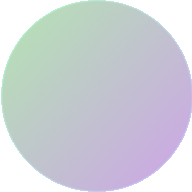

#  Winter 2021 Server

### High level goal

aria likes to have really pretty notes and things, and that is what keeps her sane when doing computer science things. She also has grandiose ideas sometimes, so there is a lot of cool ideas that might never happen.

### Table Of Contents

- [To do](#To-do)
- [Sources](#Sources)

### To do

**Immediate Server**:
- [ ] Test scripts
	- [ ] unittest redesign, but pretty
- [ ] Better URL abstraction from files
- [ ] Support for PUT requests

**Future Server:**
- [ ] Safe PUT requests? (safe folder)
- [ ] POST requests for tracking something
- [ ] Server config and folder specific config
- [ ] Javascripts for things?
- [ ] Access control

### Sources

**Golang:**
- The official [website](https://golang.org): [net/http](https://golang.org/pkg/net/http/), [strings](https://golang.org/pkg/strings/)
